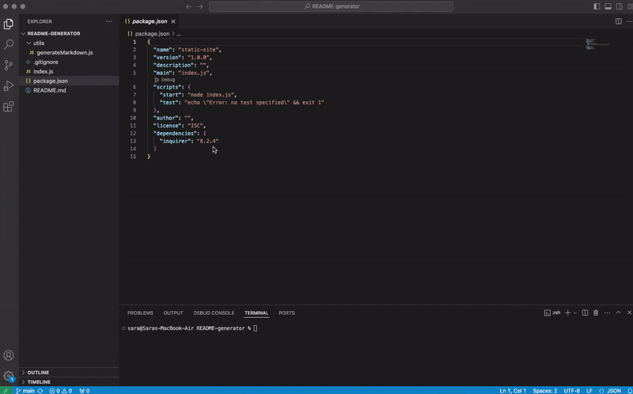

  # Professional README Generator 
  

## Description

This command-line application dynamically generates a professional README.md file from a user's input using the [Inquirer package](https://www.npmjs.com/package/inquirer/v/8.2.4). 

## Table of Contents 

- [Installation](#installation)
- [Usage](#usage)
- [Features](#features)
- [Contributing](#contributing)
- [Test](#tests)
- [Questions](#questions)


## Installation

To clone and run this repository you'll need Git and Node.js (which comes with npm) installed on your computer. From your command line:
```
# Clone this repository
git clone git@github.com:Saraz-Git/README-generator.git

# Go into the repository
cd README-generator

# Install dependencies
npm i

# Run the app
npm start
```
## Usage
```
GIVEN a command-line application that accepts user input

WHEN I am prompted for information about my application repository
THEN a high-quality, professional README.md is generated with the title of my project and sections entitled Description, Table of Contents, Installation, Usage, License, Contributing, Tests, and Questions

WHEN I enter my project title
THEN this is displayed as the title of the README

WHEN I enter a description, installation instructions, usage information, contribution guidelines, and test instructions
THEN this information is added to the sections of the README entitled Description, Installation, Usage, Contributing, and Tests


WHEN I choose a license for my application from a list of options
THEN a badge for that license is added near the top of the README and a notice is added to the section of the README entitled License that explains which license the application is covered under

WHEN I enter my GitHub username
THEN this is added to the section of the README entitled Questions, with a link to my GitHub profile

WHEN I enter my email address
THEN this is added to the section of the README entitled Questions, with instructions on how to reach me with additional questions

WHEN I click on the links in the Table of Contents
THEN I am taken to the corresponding section of the README
```
## Features

* Nodejs

* npm inquirer

## Contributing

[](https://www.contributor-covenant.org/) 

## Tests

The following image shows the web application's appearance and functionality:
]

## Questions

Github Profile [Link](https://github.com/Saraz-Git).

For all related questions please email <sample@gmail.com>.

## Review

* A walkthrough video demonstrating the functionality of the application: [video](https://www.loom.com/share/973864eebd6b42dea13dc705dcd25d73?sid=c05d16b1-b4c3-43b6-a9dd-9481b0095d51)

* A sample result: This repository's README file is generated using this application.

* The URL of the GitHub repository: https://github.com/Saraz-Git/README-generator


